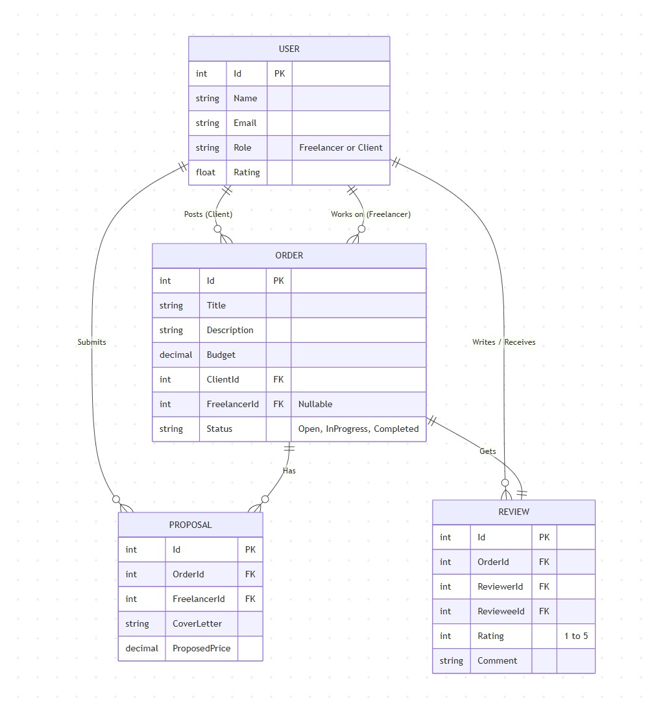

# Онлайн-платформа для фрілансерів

## 5 основних функцій проекту:
1. **Реєстрація та авторизація з ролями:** Користувачі можуть реєструватися як "Фрілансери" або "Замовники" для доступу до відповідного функціоналу.
2. **Публікація замовлень (для Замовників):** Можливість створювати нові проекти, вказуючи опис завдання, вимоги, бюджет та терміни виконання.
3. **Пошук та фільтрація (для Фрілансерів):** Перегляд стрічки доступних замовлень з можливістю пошуку за категоріями послуг та бюджетом.
4. **Відгуки на замовлення:** Фрілансери можуть залишати свої пропозиції (відгуки) під замовленнями, а замовники — обирати найкращого кандидата.
5. **Система рейтингу та коментарів:** Після завершення співпраці замовник та фрілансер можуть залишити коментар та оцінити роботу одне одного (від 1 до 5 зірок).

## Схема бази даних
